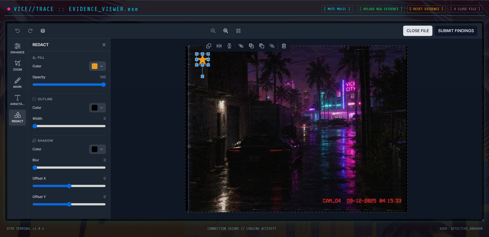

# VICE//TRACE 🕵️‍♂️🌴
### A GTA VI-Inspired Detective Experience

<p align="center">
  
</p>

> **Every picture tells a story. Someone changed it.**

## 🎮 The Concept
**VICE//TRACE** is an interactive narrative micro-game built for the Unlayer React Image Editor Challenge. 

Instead of building a standard photo editor or poster maker, I created a **Vice City Police Department (VCPD) terminal**. Players step into the shoes of a detective in modern-day Vice City (Leonida). They are presented with a crime scene photo that Internal Affairs believes has been tampered with to protect a suspect. 

The player must use the image editor to inspect, enhance, and redact the evidence to find the lie. Once they spot the inconsistency, they submit their findings. Choose correctly, and the case is closed. Choose wrong, and the detective's career is over.

## 🛠️ How I used the Unlayer React Image Editor
The Unlayer editor is the **core gameplay mechanic**, not just a decorative tool. To make it feel like authentic police forensic software, I customized it heavily using the official Unlayer React component API:

* **Custom Tool Translations:** I renamed the default tools to fit the detective theme:
  * `Filter` ➔ `ENHANCE`
  * `Crop` ➔ `ZOOM`
  * `Shapes` ➔ `REDACT` (Used to black out/censor faces or license plates)
  * `Draw` ➔ `MARK`
  * `Text` ➔ `ANNOTATE`
* **Custom Font Awesome Icons:** Swapped the default Unlayer icons for police/investigation icons (e.g., `fa-eye-slash` for REDACT, `fa-search-plus` for ZOOM).
* **Restricted Tools:** Disabled `resize`, `stickers`, and `frame` to keep the player focused on the investigation.
* **Dark Theme & Left Dock:** Configured via `options` to match the CRT terminal aesthetic.
* **Dynamic Image Swapping:** Built a custom `[ UPLOAD NEW EVIDENCE ]` button that uses the `FileReader` API to convert local files to Base64 and dynamically update the Unlayer `image` prop.
* **Real Exporting:** When the player clicks "Submit Findings", the Unlayer `onSave` handler captures the `dataUrl` and downloads the edited PNG directly to the player's computer as evidence.

## ✨ Features & Polish
* **CRT Monitor Aesthetic:** Custom CSS scanlines, flicker effects, and retro terminal fonts (`Share Tech Mono`).
* **Cinematic Boot Sequence:** A fake BIOS/hacking screen on startup that fades into the briefing, while the background music fades in dynamically.
* **Web Audio API Sound Design:** Synthesized 8-bit retro beeps, errors, and success chimes directly in the browser using the Web Audio API—no heavy audio files needed.
* **Dynamic Story States:** Start screen ➔ Booting Sequence ➔ Briefing ➔ Connecting Uplink ➔ Editor ➔ Accusation ➔ Verdict (Solved/Failed).
* **Resizable Workspace:** The editor container uses native CSS `resize: vertical` so the user can drag the bottom corner to make the investigation workspace as large as they need it.

## 💻 Tech Stack
* **Framework:** Next.js 16 (React)
* **Editor:** `@unlayer/react-image-editor`
* **Styling:** Tailwind CSS + Custom CSS animations
* **Audio:** Web Audio API

## 🚀 Run Locally
1. Clone the repository:
   ```bash
   git clone https://github.com/YOUR_USERNAME/vice-trace.git
   ```
2. Navigate to the project directory:
   ```bash
   cd vice-trace
   ```
3. Install dependencies:
   ```bash
   npm install
   ```
4. Start the development server:
   ```bash
   npm run dev
   ```
5. Open [http://localhost:3000](http://localhost:3000) in your browser to play.

---
Built for the #BuiltWithImageEditor Challenge.